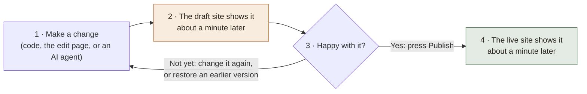

# Divi without WordPress

*How the My Healing Oasis site is built, edited and published, described in the terms Andrew used. Prepared 17 September 2026. The diagrams are in [workflow.md](workflow.md); the tool names are in the last section, because they are the least important part.*

You described what you want as Divi without WordPress: the same way of thinking about a page, fully customisable, operated by your AI agents rather than by a screen. That is what this is. Sections, modules, one content file, global styles, editing in place, history with undo. No database, no plugins, no updates, and nothing that holds the pages hostage.

## The loop

Every change, from anyone, goes around one loop.

The draft site is a real copy of the site at its own address. Nothing reaches the live site until someone presses Publish. Every earlier version is kept, and any of them can be brought back with one click.

## Divi's ideas, and where each one lives here

| In Divi | Here | Where |
|---|---|---|
| A page is a stack of sections | A page is a stack of sections | `src/components/Home.astro` lists them in order |
| A section is built from modules: a stat card, a testimonial, a call to action | One template per section, and a template for each repeated piece inside it | `src/components/`: seven sections, plus `Stat` and `TestimonialCard` |
| A module's text and settings are data, not code | Every word on the site is in one file | `content/home.json` |
| Global colours and fonts, set once, used everywhere | Same | `src/styles/tokens.css` |
| Edit the page as it looks | The edit page is the site itself, with every line editable | the edit page on the draft site |
| History, with undo | The Versions panel on the edit page. Undo and Restore make a new version; nothing is ever destroyed | |
| The library: save a piece, reuse it | A template is a file. Copy it, or write a new one. Your agents are good at this | `src/components/` |
| Header and footer shared by every page | The base layout, with the `Nav` and `Footer` templates | `src/layouts/Base.astro` |
| Responsive settings per device | Rules in the stylesheet at three widths | `src/styles/global.css` |
| Divi AI | Your own agents, from any vendor, reading `AGENTS.md` first | |

What Divi has that this does not:

- **A drag-and-drop screen.** You said the agents will do the operating, so there is none.
- **Per-device settings on each module.** Here the responsive rules are in the stylesheet, which is where an agent would look for them anyway.
- **Interactive modules** such as contact forms and sliders. A static site handles those with an embed or a small service. None is built yet.
- **Section order in the content file.** Today it is a list in one template. Moving it into the content file is about an hour's work if you want it there.

## What you build, and what is already built

You build, and can change whenever you like:

- the sections, and the order they appear in
- new modules, each one an HTML file with holes where the words go
- the colours, fonts, spacing and layout
- the words

Already built, free, and not yours to maintain:

- the assembler that turns templates plus content into finished pages
- the draft site, which rebuilds itself about a minute after every change
- the edit page and the Versions panel
- Publish, which copies draft to live
- hosting, on Dreamhost once it moves there

The custom part is the part that shows. The plumbing is the part nobody wants to own.

## Your criteria

From our first conversation, 10 September:

| # | What you asked for | Where it stands |
|---|---|---|
| 1 | Hosted on Dreamhost; edits propagate automatically | Every change rebuilds and uploads the site with nobody touching the server. This proof of concept uploads to GitHub Pages. The Dreamhost version is the same file with an upload step at the end. It is written but has not been run, because there is no Dreamhost access yet. |
| 2 | Modular styling, live reload, lighter than React | One template per section, colours and fonts in one file, the page reloads as you edit, and the finished site contains no JavaScript at all. |
| 3 | Anya sees real drafts and can fix small things herself | The draft site is a real copy. The edit page needs no account and no code. Publish is hers to press. |
| 4 | Copy lives in one file | `content/home.json`. |
| 5 | No ecosystem lock-in, as little JavaScript as possible | The finished site is HTML and CSS. The words are a plain file. The styles are the mockup's own CSS. Everything is open source. See "Leaving" below. |
| 6 | Third-party media and payments, self-indemnified | Not built in the proof of concept. A static page can embed a video or link to a hosted checkout with nothing running on the site's own server. |
| 7 | AI agents need code access; Anya must not need an IDE | One folder of files. Agents edit the files. Anya uses the edit page. Same draft site, same Publish, for everyone. |
| 8 | Free, open source, self-managed | Every tool is open source and free. Dreamhost is the only bill. Nothing depends on one person or one company staying around. |

Items 3, 7 and 8 together decide what the editing surface can be. It has to be something Anya can open, and something more than one person can run. Anything that lives on one machine or behind one login does not meet them, however good it is.

## Who touches what

Nobody in this list has to learn git.

- **Your agents** open the folder, change files, and push. Every model already knows how to do this; it is the most common thing they are asked to do. `AGENTS.md` at the top of the folder tells them the rules of this site. If your agents can run commands, they fit as they are. If they can only hand you a file, the edit page takes it from there.
- **Anya** opens the edit page on the draft site, changes a line, presses Save. A minute later it is on the draft site. When she is happy, she presses Publish.
- **Anthony** works in a code editor and pushes.
- **You**, to see or undo any change, open the Versions panel on the edit page. Restore any earlier version with one click. No commands.

The shared folder lives on GitHub. It plays four roles: the one copy of the files everyone works from, the history of every change, the machine that rebuilds the site for free, and the thing that uploads it. Anything that replaced it would have to do all four.

## Leaving

Divi kept the pages inside itself; take Divi away and the pages fell apart. This does not. The finished site is a folder of HTML and CSS that can go on any host. The words are a plain file. The styles are ordinary CSS. If the assembler were replaced tomorrow, the only work would be rewriting seven short templates.

## Still open

- The Dreamhost upload is written but has not been run.
- The small server behind the Save button runs on Anthony's laptop for the demo. Its permanent home is Dreamhost.
- The edit page has no password yet. Turning one on is one setting.
- Forms, video, payments: not started. Each is an embed or a link.
- The phone number and address are placeholders until launch.

## Under the hood

The assembler is Astro. Astro is not something the site runs on; the site does not run on anything. It is the tool that writes the site. Think of a mail merge: the templates are the letter, the content file is the address list, and the build is pressing Print. Visitors get the printed pages. The mail-merge program never leaves the office.

A template is the HTML for one section with holes where the words go. Astro fills the holes and writes the pages. That is its whole job here. It has no opinion about the sections, the styles, the content, or the workflow. Those are ours.

Why not write the assembler ourselves:

- Every AI agent already knows Astro, git and GitHub deeply. They know nothing about a tool that exists nowhere else, and would have to be taught it on every task, by the one person who knows it.
- Someone else fixes its bugs.
- It gives us the live-reloading dev server, and the second rendering of the site as the edit page, for free.
- It can be replaced. The content, styles, images, fonts, workflows and relay do not depend on it.

If you would still rather build the assembler yourself, the contract is small: read `content/home.json` and the templates in `src/components/`, and write finished pages into `dist/`. When yours does that, it can be swapped in and nothing else changes.

The other pieces:

- **GitHub** holds the folder and its history, and runs the builds.
- **The relay** is a 186-line script with no dependencies. It turns Save on the edit page into a change in the folder, and Publish into the publish step.
- **Pages CMS** is an optional form view of the same content file, for images and links.
- **Dreamhost** will host the finished pages.
