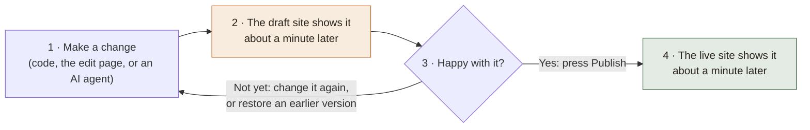
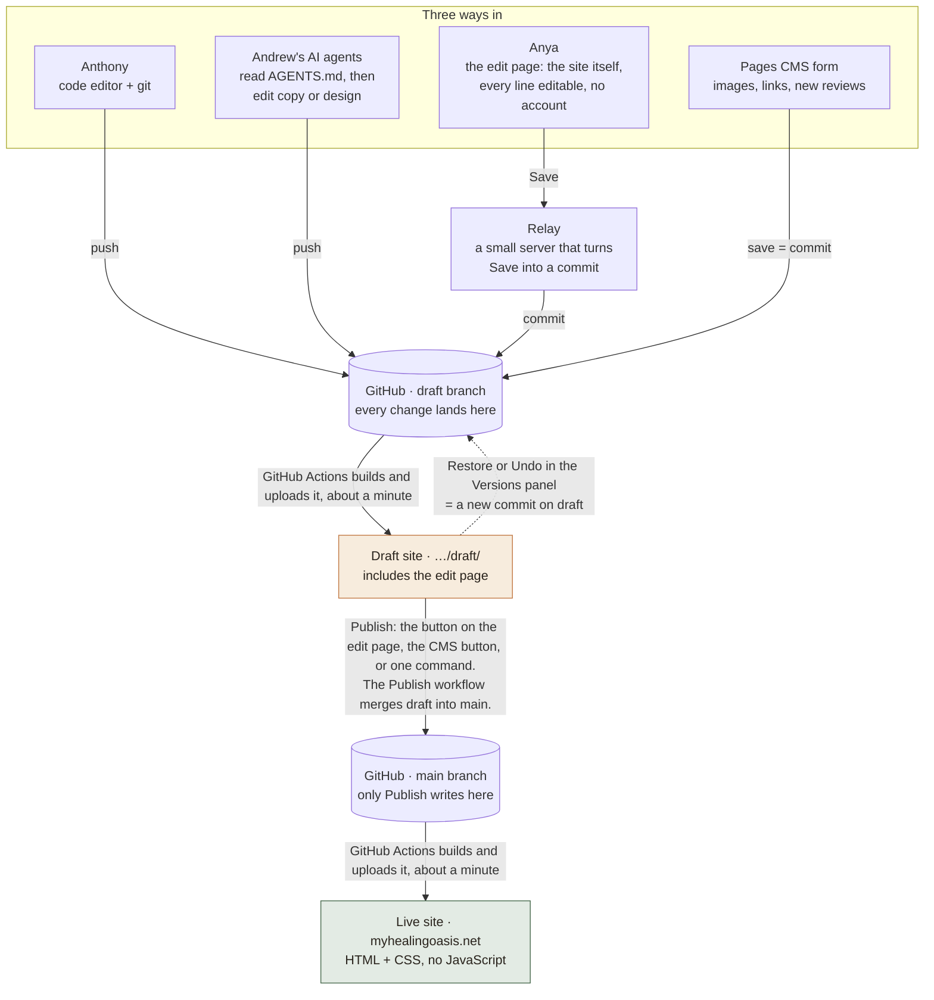
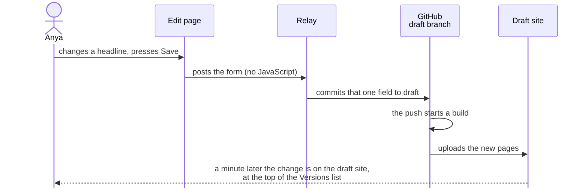
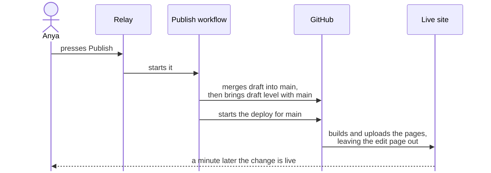

# How the site gets edited and published

Diagrams for the My Healing Oasis site. They are written in [Mermaid](https://mermaid.js.org): GitHub renders them in place, VS Code previews them with a Mermaid extension, and https://mermaid.live edits them.

The case for this design, written for Andrew in Divi terms, is in [proposal.md](proposal.md).

## The loop

Every change, from anyone, goes round this loop. Nothing reaches the live site without a person pressing Publish.

## Who does what

Three ways in, one repository, two branches, two sites. Everyone lands on the draft branch; only Publish writes to main.

## What happens when someone presses Save

The edit page is the home page with every line turned into a form field. Save posts the form to the relay, which writes one commit.

## What happens when someone presses Publish

Publish is one workflow. It merges draft into main, rebuilds the live site, and leaves the two branches identical.

